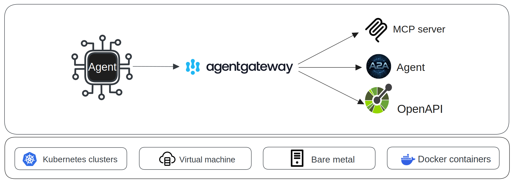
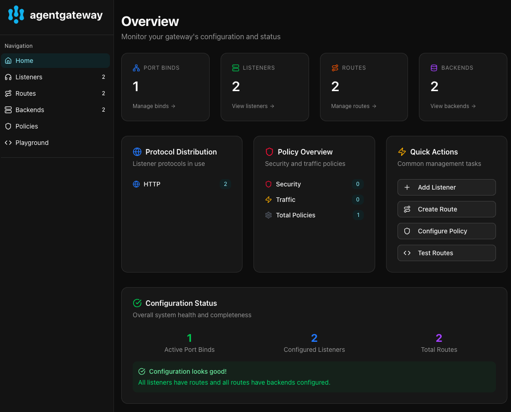

  <picture>
    <source media="(prefers-color-scheme: dark)" srcset="https://raw.githubusercontent.com/agentgateway/agentgateway/refs/heads/main/img/banner-light.svg" alt="agentgateway" width="400">
    <source media="(prefers-color-scheme: light)" srcset="https://raw.githubusercontent.com/agentgateway/agentgateway/refs/heads/main/img/banner-dark.svg" alt="agentgateway" width="400">
    
  </picture>
  

    
    
    
    
    
    
  

  

    The <strong>first complete</strong> connectivity solution for Agentic AI.
  

---

**Agentgateway** is an open source data plane optimized for agentic AI connectivity within or across any agent framework or environment. Agentgateway provides drop-in security, observability, and governance for agent-to-agent and agent-to-tool communication and supports leading interoperable protocols, including [Agent2Agent (A2A)](https://developers.googleblog.com/en/a2a-a-new-era-of-agent-interoperability/) and [Model Context Protocol (MCP)](https://modelcontextprotocol.io/introduction).

  

  

 

## Intro to Agentgateway Video

## Key Features:

- [x] **Highly performant:** agentgateway is written in rust, and is designed from the ground up to handle any scale you can throw at it.
- [x] **Security First:** agentgateway includes a robust MCP/A2A focused RBAC system.
- [x] **Multi Tenant:** agentgateway supports multiple tenants, each with their own set of resources and users.
- [x] **Dynamic:** agentgateway supports dynamic configuration updates via xDS, without any downtime.
- [x] **Run Anywhere:** agentgateway can run anywhere with any agent framework, from a single machine to a large scale multi-tenant deployment.
- [x] **Legacy API Support:** agentgateway can transform legacy APIs into MCP resources. Currently supports OpenAPI. (gRPC coming soon)
 

## Getting Started 

To get started with agentgateway, please check out the [Getting Started Guide](https://agentgateway.dev/docs/quickstart).

## Documentation

The agentgateway documentation is available at [agentgateway.dev/docs](https://agentgateway.dev/docs/). Agentgateway has a built-in UI for you to explore agentgateway connecting agent-to-agent or agent-to-tool:

  

## Contributing

For instructions on how to contribute to the agentgateway project, see the [CONTRIBUTION.md](CONTRIBUTION.md) file.

## Community Meetings
To join a community meeting, add the [agentgateway calendar](https://calendar.google.com/calendar/u/0?cid=Y18zZTAzNGE0OTFiMGUyYzU2OWI1Y2ZlOWNmOWM4NjYyZTljNTNjYzVlOTdmMjdkY2I5ZTZmNmM5ZDZhYzRkM2ZmQGdyb3VwLmNhbGVuZGFyLmdvb2dsZS5jb20) to your Google account. Then, you can find event details on the calendar.

Recordings of the community meetings will be published on our [google drive](https://drive.google.com/drive/folders/138716fESpxLkbd_KkGrUHa6TD7OA2tHs?usp=sharing).

## Roadmap

`agentgateway` is currently in active development. If you want a feature missing, open an issue in our [Github repo](https://github.com/agentgateway/agentgateway/issues).

## Contributors

Thanks to all contributors who are helping to make agentgateway better.

### Star History

<a href="https://www.star-history.com/#agentgateway/agentgateway&Date">
 <picture>
   <source media="(prefers-color-scheme: dark)" srcset="https://api.star-history.com/svg?repos=agentgateway/agentgateway&type=Date&theme=dark" />
   <source media="(prefers-color-scheme: light)" srcset="https://api.star-history.com/svg?repos=agentgateway/agentgateway&type=Date" />
   
 </picture>
</a>
