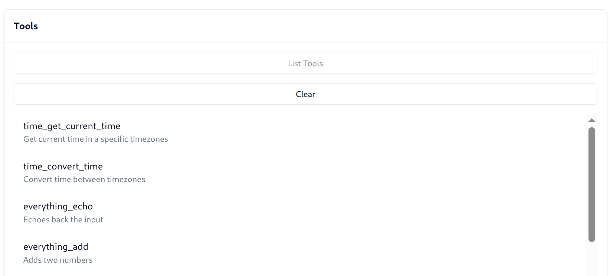

## Multiplex Example

In the [basic](../basic) example, we exposed a single MCP server.
Agentgateway can also multiplex multiple MCP servers, and expose them as a single MCP server to clients.

This can centralize and simplify client configuration -- as we add and remove tools, only the gateway configuration needs to change, rather than all MCP clients.

### Running the example

```bash
cargo run -- -f examples/multiplex/config.yaml
```

Multiplexing is only a matter of adding multiple targets. Here we will serve the `everything` and `time` server.

```yaml
targets:
- name: time
  stdio:
    cmd: uvx
    args: ["mcp-server-time"]
- name: everything
  stdio:
    cmd: npx
    args: ["@modelcontextprotocol/server-everything"]
```

Now when we open the MCP inspector we can see the tools from both `time` and `everything`.
Because we have multiple tools, each tool is prefixed with the `<name>_` to avoid collisions.



