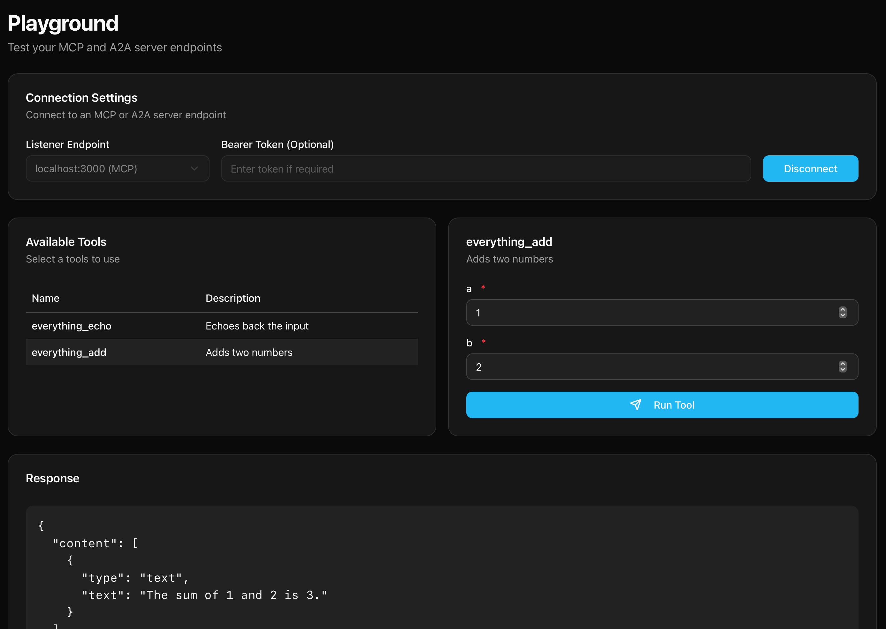

## Target Filters

This example shows how to use the agentgateway to proxy requests to the `everything` tool, but only if the request matches the target filter.

### Running the example

```bash
cargo run -- -f examples/target_filters/config.json
```

Let's look at the config to understand what's going on. First off we have a listener, which tells the gateway how to listen for incoming requests/connections. In this case we're using the `sse` listener, which is a simple HTTP listener that listens on port 3000.

```json
  "listeners": [
    {
    "sse": {
        "address": "0.0.0.0",
        "port": 3000
      }
    }
  ],
```

Next we have a targets section, which tells the gateway how to proxy the incoming requests. In this case we're using the `everything` tool, which is a tool that can do everything. In addition to defining the target, we also define a list of filters that the gateway will use to determine if the tool should be exposed to the client.

```json
  "targets": {
    "mcp": [
      {
        "name": "everything",
        "filters": [
          {
            "type": "tool",
            "matcher": "equals",
            "match": "echo"
          },
          {
            "type": "tool",
            "matcher": "equals",
            "match": "add"
          }
        ],
        "stdio": {
          "cmd": "npx",
          "args": [
            "@modelcontextprotocol/server-everything"
          ]
        }
      }
    ]
  }
```

Now that we have the gateway running, we can use the admin server to list the targets and see the filters that are defined. In a browser navigate to `localhost:19000` and then navigate to the playground page.


Once you're on the playground page, you can navigate to the tools tab and see the available tools.



